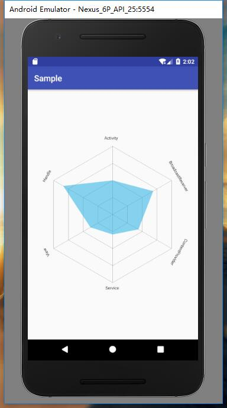

# MyPolygonView
> 一个自定义View，多边形的统计图

- [博客讲解](https://totoroxkf.github.io/2018/01/06/Android%E8%87%AA%E5%AE%9A%E4%B9%89%E5%A4%9A%E8%BE%B9%E5%BD%A2%E7%BB%9F%E8%AE%A1%E5%9B%BE/)

### 预览


### 如何使用
- 添加依赖

  在根目录下的build.gradle文件中添加
````
  allprojects {
		repositories {
			...
			maven { url 'https://jitpack.io' }
		}
	}
````

  在app目录下的build.gradle文件中添加添加
````
  dependencies {
		compile 'com.github.TotoroXkf:MyPolygonView:V1.0.3'
	}
````

- 使用组件

  在xml中
````
  <com.totoro.xkf.polygonview.PolygonView
        android:id="@+id/pv_polygon_view"
        android:layout_width="match_parent"
        android:layout_height="match_parent"
        app:areaColor="@android:color/holo_blue_light"
        app:edgeColor="@android:color/black"
        app:edgeCount="6"
        app:loopCount="4"
        app:textColor="@android:color/black" />
````
  java代码中
````
  //组件必须设置的值为eageCount，也就是边数，必须大于3
        //loopCount，有几层，必须大于0
        //每个方向的值
        PolygonView polygonView = findViewById(R.id.pv_polygon_view);
        //设置每个方向的值
        //如果不设置的话就不会绘制
        List<Float> pointValue = new ArrayList<>();
        //每个方向值的大小不能超过1，在是那个方向的整体比例，请计算好在设置
        //pointValue的size一定要大于边数
        for (int i = 0; i < polygonView.getEageCount(); i++) {
            pointValue.add((float) (Math.random() * 1));
        }
        polygonView.setPointValue(pointValue);
        //每个方向的的文字，可以不设置
        List<String> pointName = new ArrayList<>();
        pointName.add("Activity");
        pointName.add("BroadcastReceiver");
        pointName.add("ContentProvider");
        pointName.add("Service");
        pointName.add("View");
        pointName.add("Handle");
        polygonView.setPointName(pointName);
        //如果不调用这个方法的话，组件可以正常绘制，但是没有动画效果
        polygonView.draw();
````

之后就可以运行出理想的结果了~~~~
